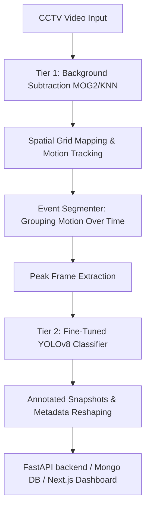

# ExamVision AI — Offline Video Segmentation & ROI Detection Using Motion Estimation

ExamVision AI is an offline CCTV video monitoring and proctoring audit suite designed to monitor classroom exams for potential academic dishonesty. It operates in a high-performance **two-tier architecture**:

1. **Tier 1: Motion Detection & Segmentation** — A fast background-subtraction stage (OpenCV MOG2/KNN) partitions the classroom into a spatial grid to track movement in regional zones. Active motion is grouped temporally into discrete candidate events.
2. **Tier 2: YOLO Classification** — Peak frames of flagged events are evaluated using a fine-tuned YOLOv8 model to classify specific cheating behaviors (chits, phone, hand, peeking, supplement-passing).



---

## 🛠️ Technology Stack
* **AI/ML Engine**: Python 3.12, PyTorch, OpenCV, NumPy, Ultralytics YOLOv8
* **Backend Server**: FastAPI, Uvicorn, MongoDB
* **Audit Dashboard**: Next.js (App Router), React, Tailwind CSS, Lucide React

---

## 📁 Repository Directory Structure

* [AI-ML/](file:///D:/ExamVision_Ai/AI-ML) — Spatial motion segmentation and object detection logic.
  * [AI-ML/src/pipeline.py](file:///D:/ExamVision_Ai/AI-ML/src/pipeline.py) — End-to-end orchestration pipeline script.
  * [AI-ML/src/detection/detector.py](file:///D:/ExamVision_Ai/AI-ML/src/detection/detector.py) — YOLOv8 inference wrapper.
  * [AI-ML/models/](file:///D:/ExamVision_Ai/AI-ML/models) — Fine-tuned YOLO weight checkpoints (`v4`, `v7`, `v8`).
* [Backend/](file:///D:/ExamVision_Ai/Backend) — FastAPI application serving the system API.
  * [Backend/app/config.py](file:///D:/ExamVision_Ai/Backend/app/config.py) — Environment configs, fallback virtual env paths, and database bindings.
* [frontend/](file:///D:/ExamVision_Ai/frontend) — Next.js review audit dashboard.

---

## 🚀 Getting Started & Installation

### 1. Download Fine-Tuned Model Checkpoint
Before starting the backend or executing the pipeline, download the fine-tuned model checkpoint:
* **Default Model Weights**: [phone_chit_detector_v4.pt](https://github.com/theadarshbhushan/ExamVision_Ai/releases/download/v1.0-model/phone_chit_detector_v4.pt) (5.93 MB)
* **Destination**: Save to `D:\ExamVision_Ai\AI-ML\models\phone_chit_detector_v4.pt`.

---

### 2. Component Setup

#### Component A: AI/ML Detection Engine & Standalone CLI
Setup a dedicated virtual environment in the project root:
```powershell
# 1. Create root virtual environment
python -m venv .venv

# 2. Activate root environment (PowerShell)
.venv\Scripts\Activate.ps1

# 3. Install ML dependencies (PyTorch & Ultralytics YOLO)
pip install -r AI-ML/requirements.txt
```

#### Component B: FastAPI Backend Server
Create a backend environment, configure the `.env` parameters, and launch the API server:
```powershell
# 1. Navigate to Backend
cd Backend

# 2. Create and activate a separate virtual environment
python -m venv venv
venv\Scripts\Activate.ps1

# 3. Install API dependencies
pip install -r requirements.txt
```

Create a `.env` file at `Backend/.env` with the following variables:
```env
MONGO_URI=mongodb://localhost:27017
MONGO_DB_NAME=examvision_db
JWT_SECRET=your_jwt_secret_key_here
JWT_ALGORITHM=HS256
```

Start the FastAPI server:
```powershell
uvicorn app.main:app --port 8000
```
> [!IMPORTANT]
> **Why uvicorn `--reload` is disabled by default**:
> When running the pipeline job, backend subprocesses write snapshots and status JSONs to `Backend/app/data/`. If uvicorn runs with `--reload`, it detects these new files and restarts mid-process, terminating the running pipeline subprocess and leaving jobs permanently stuck in `running` status.

#### Component C: Next.js Frontend Audit Dashboard
Install frontend node dependencies and launch the live web dashboard:
```powershell
# 1. Navigate to frontend
cd frontend

# 2. Install dependencies
npm install

# 3. Start Next.js development server
npm run dev
```
* Access the portal at: `http://localhost:3000`
* Configured api client base url: `http://localhost:8000`

---

## 💻 Running the Standalone AI-ML Pipeline

You can run the full pipeline manually from the root directory (`D:\ExamVision_Ai`) using the root python environment:

```powershell
.venv\Scripts\python.exe AI-ML/src/pipeline.py --input <path_to_video.mp4> --output <path_to_output_json> --snapshot-dir <path_to_snapshot_directory>
```

### Selecting Model Version
By default, the pipeline falls back to `phone_chit_detector_v4.pt`. If you want to force the pipeline to use a different model weight configuration, set the `ACTIVE_DETECTOR_MODEL` environment variable before execution:

* **Using PowerShell**:
  ```powershell
  $env:ACTIVE_DETECTOR_MODEL="D:\ExamVision_Ai\AI-ML\models\phone_chit_detector_v7.pt"
  ```
* **Using Command Prompt**:
  ```cmd
  set ACTIVE_DETECTOR_MODEL=D:\ExamVision_Ai\AI-ML\models\phone_chit_detector_v7.pt
  ```

---

## 🔍 Troubleshooting & Known Limitations

### Video Format Error: `moov atom not found`
If the pipeline fails during initial setup with the traceback:
`OSError: Could not open video file: ...`
and displays the logs:
`[mov,mp4,m4a,3gp,3g2,mj2 @ 0x...] moov atom not found`

> [!WARNING]
> This indicates that the input video file is corrupted, truncated, or incomplete. Ensure the video file is completely downloaded and not currently being modified by another active process.

### CCTV-Distance Chit Detection
Due to the low resolution footprint of physical cheat sheets (chits) in CCTV camera views (~18x20 pixels after resizing), they can sometimes be missed or yield low confidence scores (~0.55%). For enhanced precision:
* Collect more high-resolution cheat sheet labels.
* Use camera feeds positioned closer to student desks.
* Retrain model variants using the script [train_detector.py](file:///D:/ExamVision_Ai/AI-ML/src/detection/train_detector.py).
